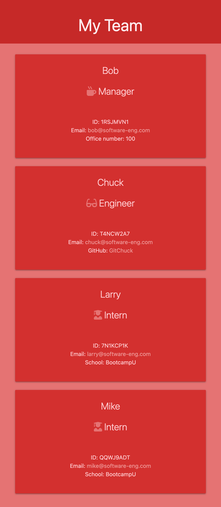

# Template Engine: Employee Summary

## Description

Node command line application that uses inquirer to take in information about employees and generates an HTML page that displays summaries for each employee. The application will prompt the user for information on the manager, and then will inquire for information on any additional team members which can be any mix of engineers and interns. All prompts are validated to ensure appropriate input to generate the correct output.

## Table of Contents

- [Visuals](#visuals)
- [Installation](#installation)
- [Usage](#usage)
- [Tests](#tests)
- [Questions](#questions)
- [License](#license)

## Visuals

### Small Screen View

### Regular View

## Installation

After copying the repository to your local machine, run `npm install` to download the project's dependencies before using the application.

## Usage

Begin by running the command `node app` to start-up the CLI. Answer the series of prompts until you have provided information for all your team members. Exit the CLI by answering `n` to the prompt `Add another member?` after adding your last team member to exit the CLI. Upon successful completion of all the inquirer prompts, your HTML webpage will be generated and output into the ‘output’ folder of the project.

## Tests

Tests for each Class (in the lib directory) are available within the 'tests' directory. To initialize, run `npm run test`.

## Questions

Please feel free to contact via email if you have any questions pertaining to this project.  
Email: jkole822@gmail.com  
[GitHub Profile](https://github.com/jkole822)

## License

[MIT](https://choosealicense.com/licenses/mit)
